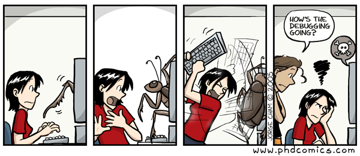

# Logging, debugging, tracing, profiling



## What to do when something is not working?

1. Identify the sympthom!

2. Break down the problem to managable chunks!

3. Investigate each separately!

4. Fix the issue!

## Identifing the symthom

* Check the intended usage with ours!
* Reproduce the problem!
* Automate reproduction if possible!
* Be very specific about the problem!

## Break down the problem

### Identify the problematic part of the software
* packages
* modules
* thread
* process
* classes
* functions
* statements
* data types

### Inspect the problematic part
#### by printing

* works on all platforms with console access
* source modifiaction is needed
* not ideal on live systems
* preformance issues when used too heavily

#### by debugging

* ```faulty.cpp``` example
* no source modificaion
* recompilatation may be needed
* ideal for sequential programs
* integrates well with IDEs
* not working on embedded or live environment
* not working on concurrent systems
* performance overhead

#### by tracing

* RefactorErl example
* no source modification
* ideal on concurrent systems
* not working on embedded systems with limited resources
* performance overhead

#### by logging

* built-in to the source code
* debug levels
  * INFO, LOW, MEDIUM, HIGH, CRITICAL
  * debug level: 0, ..., 9
* works on live systems
* no performance overhead when not activated
* might be runtime performance issue

### What about runtime properties?

* no fault in logic
* slow performance
* memory leaks
* memory consumption
* network usage

#### by logging

* offline or online analytics
* metrics tools

#### by profiling

* saving runtime details to intermediary format
* analyzing data offline
* detailed/interactive report
* ideal to find bottlenecks
* memory leak detection
* kind of art to interpret data
* two kinds
  * intrumentation based
  * sampling based
* valgrind-family
* performance metrics

### Debugger features

- python script integration
- conditional break point, counters
- pretty printer (for specific datas tructures)
- watch point (break, if memory area has been modified)
- set next statement
- fork follow mode (attach to child process?)
- signal handling
- remote debugging
- threads
- checkpoint (go back to previous program state)
- value history
